# ✈️ Airport API

Airport API is a RESTful API for managing airports, flights, routes, airplanes, crew members, orders, tickets, countries, and cities. The project is built with Django REST Framework and provides JWT authentication, filtering, searching, ordering, pagination, image uploads, and API documentation.

## ⚙️ Installation

Make sure Python 3.14 and Docker are installed.

Clone the repository:

```shell
git clone https://github.com/X08AT/airport-api-service.git
cd airport-api-service
```

Create a `.env` file based on `.env.example`:

```shell
cp .env.example .env
```

Configure the environment variables in `.env`:

```env
POSTGRES_DB=airport
POSTGRES_USER=postgres
POSTGRES_PASSWORD=your-password
POSTGRES_HOST=db
POSTGRES_PORT=5432

DJANGO_SECRET_KEY=your-secret-key
DJANGO_DEBUG=True
DJANGO_ALLOWED_HOSTS=localhost,127.0.0.1
```

Build and start the containers:

```shell
docker compose up --build
```

Apply database migrations:

```shell
docker compose exec app python manage.py migrate
```

Create a superuser if needed:

```shell
docker compose exec app python manage.py createsuperuser
```

The API will be available at:

```text
http://localhost:8000/
```

## 📚 API Documentation

### Swagger UI

```text
http://localhost:8000/api/doc/swagger/
```

### ReDoc

```text
http://localhost:8000/api/doc/redoc/
```

### OpenAPI Schema

```text
http://localhost:8000/api/doc/
```

### Django Admin

```text
http://localhost:8000/admin/
```

## 🔐 Authentication

The API uses JWT authentication.

### Register

```http
POST /api/user/register/
```

### Obtain JWT token

```http
POST /api/user/token/
```

### Refresh JWT token

```http
POST /api/user/token/refresh/
```

### Verify JWT token

```http
POST /api/user/token/verify/
```

### Manage current user

```http
GET /api/user/me/
PUT /api/user/me/
PATCH /api/user/me/
```

## ✨ Features

### ✈️ Airport Management

* Airplane types CRUD
* Airplanes CRUD
* Airplane image upload
* Crew members CRUD
* Countries CRUD
* Country flag upload
* Cities CRUD
* City image upload
* Airports CRUD
* Airport image upload

### 🛫 Flight Management

* Routes CRUD
* Flights CRUD
* Flight status management
* Crew assignment to flights
* Available seats calculation
* Taken seats information
* Flight filtering
* Flight searching
* Flight ordering
* Pagination

### 🎫 Orders & Tickets

* Create orders for authenticated users
* Retrieve user's own orders
* Ticket creation
* Seat availability validation
* Prevention of duplicate seats
* Validation of seat and row numbers
* Transactional order creation

### 🔎 Filtering, Searching & Ordering

The API supports filtering, searching, and ordering for different resources.

Flights support filtering by:

```text
status
route
airplane
departure_after
arrival_before
```

Pagination supports configurable page size with a maximum of 100 objects per page.

## 🛡️ Permissions

The API uses JWT authentication and role-based permissions.

* Authenticated users can retrieve and list airport resources.
* Staff users can create, update, and delete airport resources.
* Authenticated users can create and manage their own orders.
* Users can access only their own orders.

## 🖼️ Image Uploads

Images can be uploaded for:

* Airplanes
* Countries
* Cities
* Airports

Example:

```http
POST /api/airport/airplanes/{id}/upload-image/
```

Image upload endpoints use `multipart/form-data`.

## 🧪 Testing

Run the test suite with:

```shell
docker compose exec app python manage.py test
```

The project contains tests for models, serializers, authentication, API endpoints, validation, and image uploads.

## 🛠️ Tech Stack

* **Backend:** Python 3.14, Django 6, Django REST Framework
* **Authentication:** Simple JWT
* **Database:** PostgreSQL
* **API Documentation:** drf-spectacular, Swagger, ReDoc
* **Filtering:** django-filter
* **Testing:** Django Test Framework
* **Containerization:** Docker, Docker Compose
* **Image Processing:** Pillow

## 📸 Browsable API

### Airplanes

*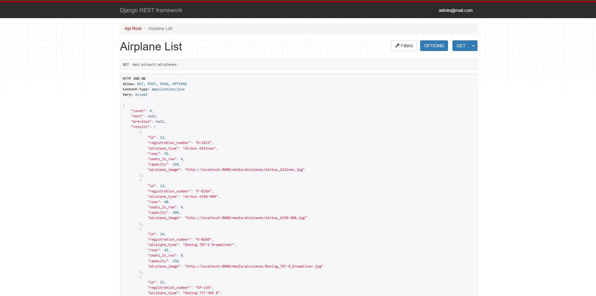*
*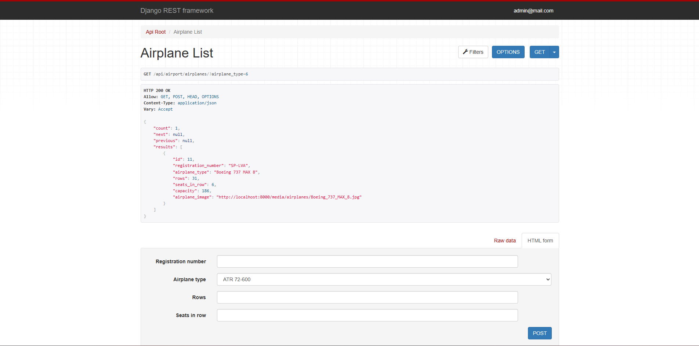*

### Airports

*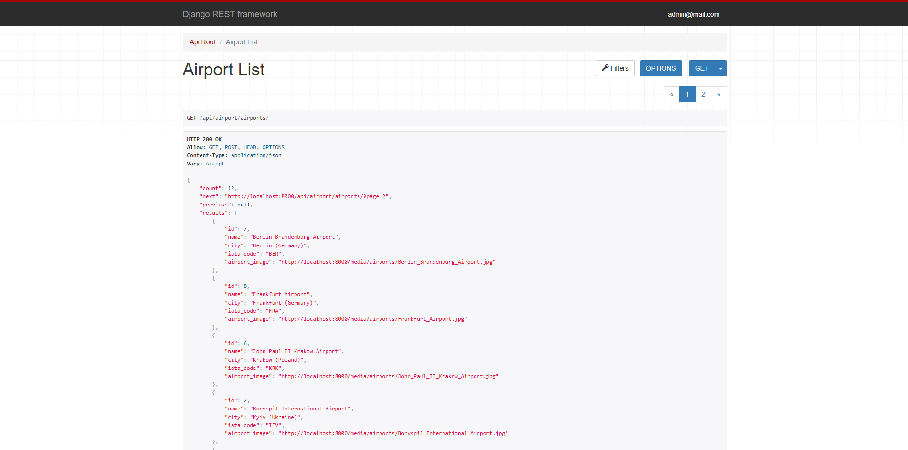*
*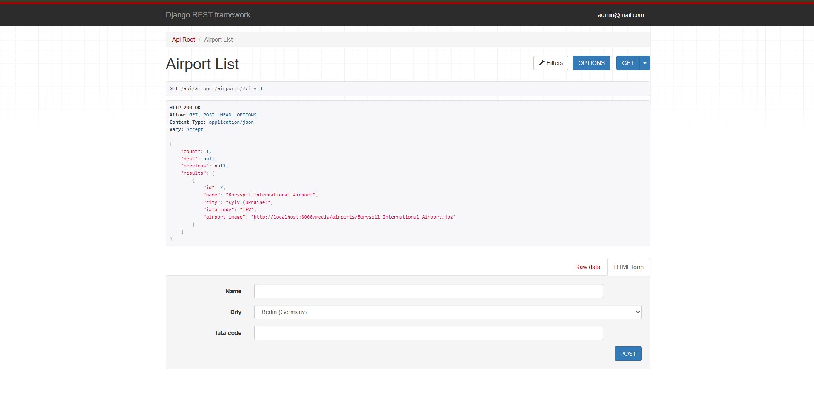*

### Flights

*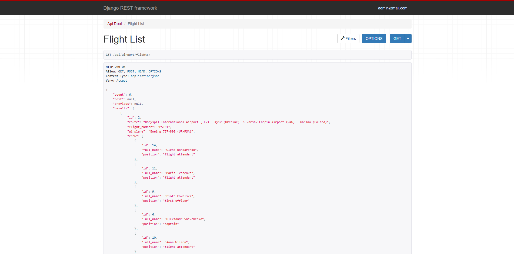*
*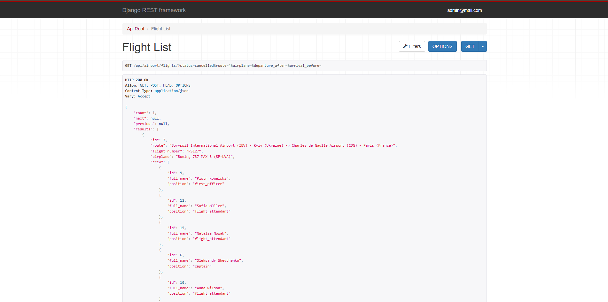*
*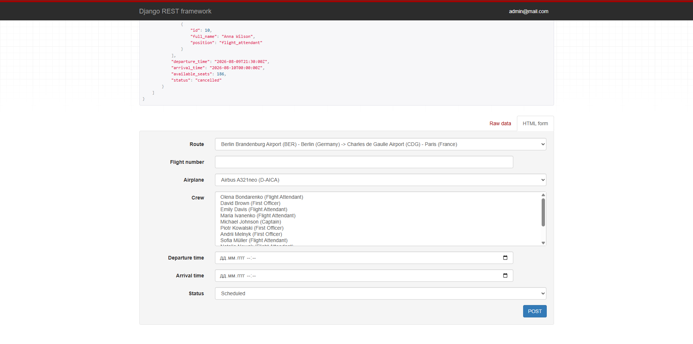*

### Orders

*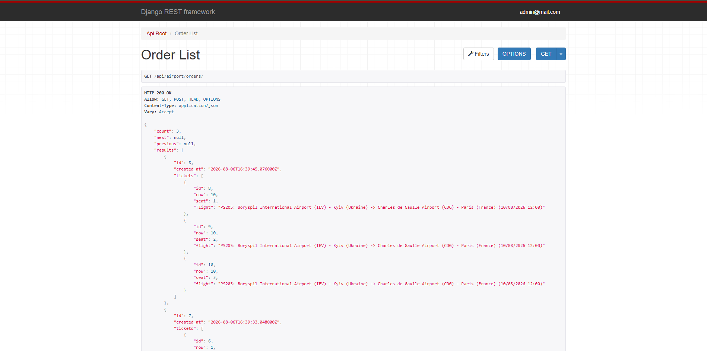*
*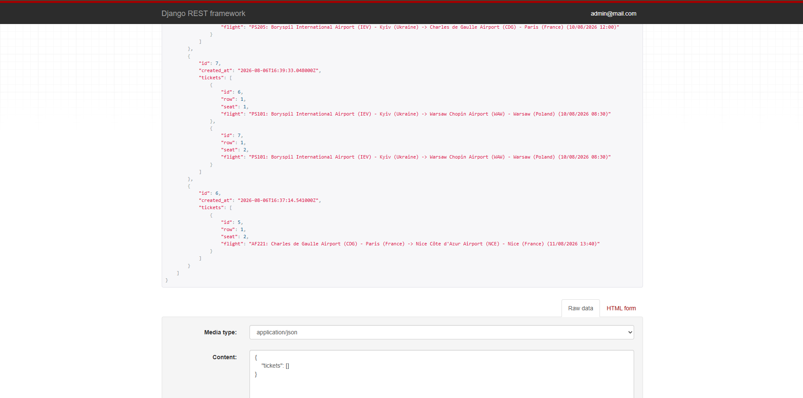*

### Swagger

*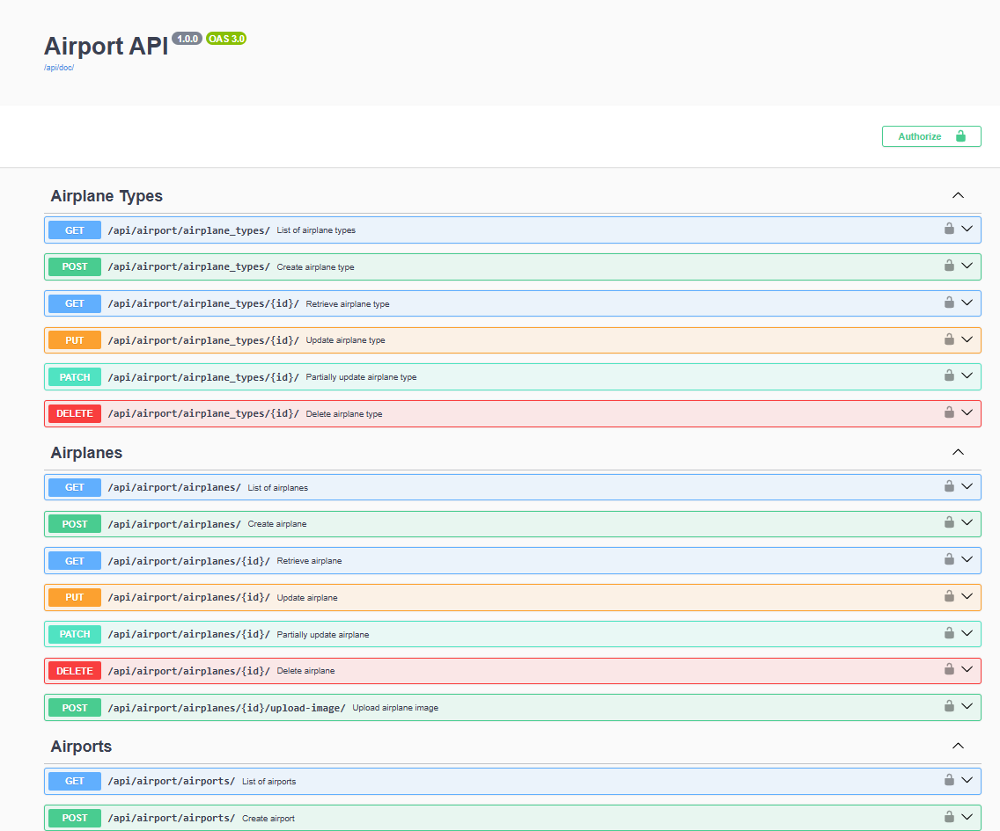*

## 🗄️ Database Structure

The project uses PostgreSQL.

Main entities:

* User
* AirplaneType
* Airplane
* Crew
* Country
* City
* Airport
* Route
* Flight
* Order
* Ticket

The database structure diagram is provided below.

*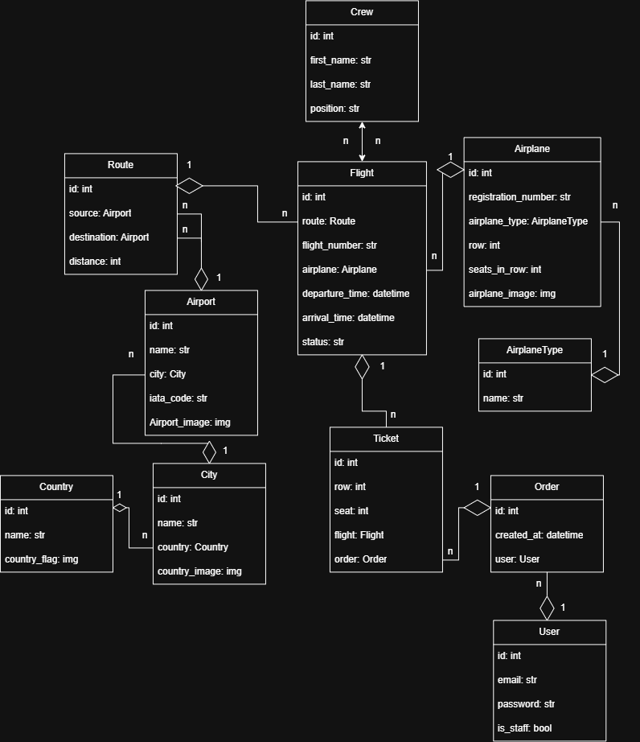*
